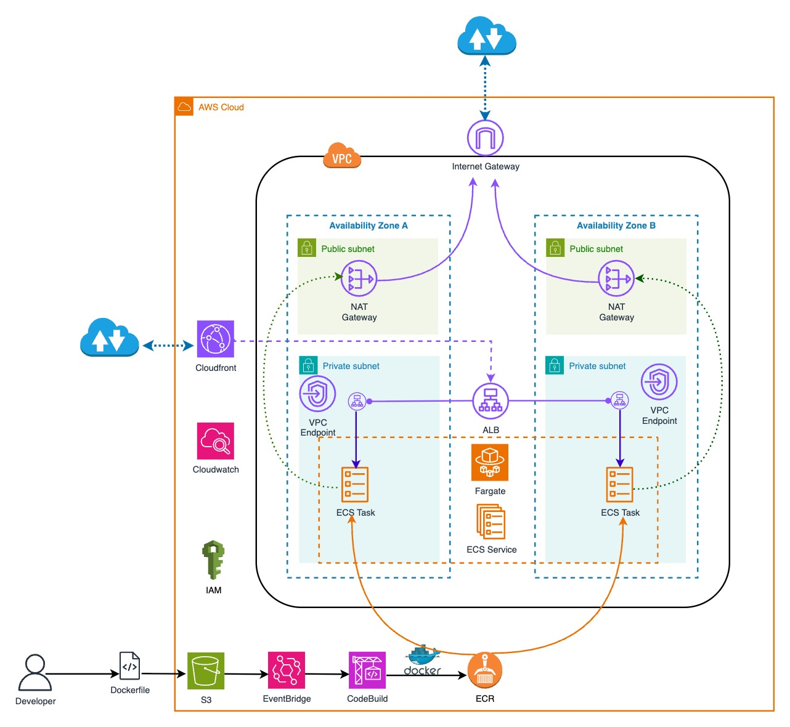

# Containers on Amazon ECS with private ALB and Cloudfront using Terraform

_Building a scalable, secure, and cost-effective containerized application deployment using AWS ECS Fargate, an internal Application Load Balancer, and CloudFront_

## Introduction

This project showcases how to run a containerised application on Amazon ECS Fargate behind an internal Application Load Balancer, exposed only through a Cloudfront distribution with VPC origin.

Container images are stored in private, KMS encrypted ECR repository with scanning enabled.

An EventBridge rule triggers a CodeBuild project to rebuild and push the image whenever the Dockerfile in S3 is updated.

The entire infrastructure is defined in Terraform, following security best practices: private subnets, least-privilege IAM roles, KMS encryption and optimized for cost efficiency.

## Architecture Overview



### Key Components

1. **Amazon ECS Fargate**  
   A serverless container runtime that eliminates the need to manage EC2 instances, allowing tasks to scale automatically based on demand.

2. **Internal Application Load Balancer (ALB)**  
   A Layer 7 load balancer deployed in private subnets, routing traffic only from a trusted CloudFront distribution (via VPC origin).

3. **Amazon CloudFront**  
   A global CDN that front-doors the ALB for SSL termination, DDoS protection, and edge caching to reduce application latency.

4. **Amazon ECR**  
   A private, KMS-encrypted Docker registry with built-in image scanning to ensure container images meet security standards before deployment.

5. **AWS CodeBuild**  
   A fully managed build service that automatically builds, tests, and pushes Docker images to ECR whenever the source Dockerfile in S3 changes.

6. **Amazon EventBridge**  
   An event bus that watches S3 for Dockerfile updates and triggers the CodeBuild pipeline to rebuild and redeploy the container image.

7. **Amazon S3**  
   Object storage for hosting the application’s Dockerfile (and any static assets), acting as the source-of-truth for build triggers.

8. **Amazon CloudWatch**
   A monitoring and observability service used to collect and analyze logs, metrics, and set alarms for ECS tasks, load balancers, and other AWS resources.

9. **VPC with Public & Private Subnets**  
   Network segmentation where ECS tasks and the internal ALB reside in private subnets, and NAT/Internet Gateways provide controlled egress.

10. **VPC Endpoints**  
    Interface and gateway endpoints that allow ECS tasks and CodeBuild to communicate privately with AWS services (ECR, S3, CloudWatch) without traversing the Internet.

11. **NAT Gateway**  
    Provides outbound Internet access for private subnet resources (ECS tasks, build jobs) to download dependencies and call external APIs.

12. **Internet Gateway**  
    Enables ingress and egress for public subnet services (e.g., CodeBuild when not using VPC endpoints) and initial VPC connectivity.

13. **IAM (Identity and Access Management)**  
    Fine-grained roles and policies that enforce least-privilege access for ECS tasks, CodeBuild projects, CloudFront, and Terraform.

14. **Terraform**  
    The infrastructure-as-code framework used to define, provision, and manage all AWS resources in modular, reusable configurations.

## Project Structure

```
currency-convertor-ecs/
├── app/
│   ├── main.py              # FastAPI application
│   ├── Dockerfile           # Container definition
│   └── requirements.txt     # Python dependencies
├── docs/
│   └── currency-convertor-ecs.jpg  # Architecture diagram
├── infra/
│   ├── main.tf              # Main Terraform configuration
│   ├── variables.tf         # Input variables
│   ├── outputs.tf           # Output values
│   ├── data.tf              # Data sources
│   ├── locals.tf            # Local values
│   ├── providers.tf         # Provider configurations
│   ├── terraform.tfvars     # Variable values
│   ├── buildspec.yml        # CodeBuild specification
│   ├── environments/
│   │   ├── dev/             # Development environment configs
│   │   └── prod/            # Production environment configs
│   ├── lambda/              # Lambda function code
│   └── modules/
│       ├── ecr/             # ECR repository module
│       │   ├── main.tf
│       │   ├── outputs.tf
│       │   ├── policy.json
│       │   └── variables.tf
│       ├── ecs-fargate/     # ECS Fargate service module
│       │   ├── cloudfront.tf    # CloudFront distribution
│       │   ├── cluster.tf       # ECS cluster configuration
│       │   ├── data.tf          # Data sources
│       │   ├── elb.tf           # Application Load Balancer
│       │   ├── iam.tf           # IAM roles and policies
│       │   ├── outputs.tf       # Module outputs
│       │   ├── service.tf       # ECS service definition
│       │   ├── task.tf          # ECS task definition
│       │   └── variables.tf     # Module variables
│       ├── codebuild.docker/    # CodeBuild automation
│       │   ├── codebuild.tf     # CodeBuild project
│       │   ├── data.tf          # Data sources
│       │   ├── iam.tf           # IAM Roles and Policies
│       │   ├── outputs.tf       # Module outputs
│       │   ├── s3.tf            # S3 bucket for artifacts
│       │   └── variables.tf     # Module variables
│       └── vpc-endpoints/       # VPC endpoints module
│           ├── data.tf          # Data sources
│           ├── locals.tf        # Local values
│           ├── main.tf          # VPC endpoints
│           ├── outputs.tf       # Module outputs
│           └── variables.tf     # Modules variables
├── architecture-diagram.drawio  # Architecture diagram source
├── currency-convertor-ecs.drawio # Project diagram source
├── trivy.yaml                # Security scanning configuration
└── README.md                 # Project documentation
```

## Application: Currency Converter API

Our sample application is a FastAPI-based currency converter that provides:

-   **Health Check Endpoint** (`/health`): Returns service status and host information
-   **Currency Conversion Endpoint** (`/convert`): Converts between currencies using external API

---

## Containerizing the Application

1. **Base Image Selection**  
   Use a minimal Python slim image to reduce attack surface and image size.

2. **Dependency Installation**  
   Upgrade `pip` and install only required packages without caching layers.

3. **Non-root Execution**  
   Create and switch to an unprivileged user for runtime, ensuring processes don’t run as root.

4. **Healthcheck Instruction**  
   Embed a Docker HEALTHCHECK that probes the `/health` endpoint at regular intervals.

5. **Entrypoint & Command**  
   Launch the FastAPI application via Uvicorn, binding to all interfaces on port 8080.

---

## Infrastructure as Code with Terraform

1. **VPC & Subnets**

    - One VPC with multiple AZs
    - Private subnets host ECS tasks and ALB
    - Public subnets host NAT and Internet gateways

2. **VPC Endpoints**  
   Interface endpoints for ECS, ECR, and CloudWatch; a gateway endpoint for S3—ensuring all AWS API calls remain within the VPC.

3. **ECR Repository Module**  
   A private, KMS-encrypted container registry with scanning enabled on push to enforce image security.

4. **ECS Fargate Module**

    - Task definition with CPU/memory settings
    - Private deployment with no public IP
    - Integrated ALB target group and listener setup

5. **Terraform**  
   Modular layout (e.g. `vpc/`, `ecr/`, `ecs-fargate/`, `vpc-endpoints/`) with input variables, outputs, and tagging conventions for consistency.

---

## Application Load Balancer Configuration

-   **Internal ALB**  
    Deployed in private subnets and accessible only via the CloudFront VPC origin.

-   **Security Controls**

    -   Listener rule forwards only requests bearing the agreed custom header

-   **Target Group Health Checks**  
    Point at the container `/health` endpoint, with thresholds for healthy/unhealthy state transitions.

---

## CloudFront Distribution

1. **VPC Origin**  
   CloudFront is configured to pull from the internal ALB via its VPC origin, obviating Internet Gateway exposure.

2. **Custom Header Injection**  
   Adds a secret header (`X-CloudFront-Secret`) to every origin request, which the ALB listener validates before forwarding.

3. **Cache Behavior**

    - All HTTP methods allowed, but only GET/HEAD cached
    - Zero TTLs for dynamic API responses
    - Redirect HTTP to HTTPS at the edge

4. **Viewer Certificate**  
   Uses the default CloudFront certificate for immediate HTTPS support without ACM provisioning.

## Automation Through CodeBuild

1. **EventBridge Trigger**  
   Watches the S3 bucket where the Dockerfile lives and fires when it changes.

2. **Build Project**

    - Logs in to ECR
    - Builds and tags the Docker image
    - Pushes to the private ECR repository

3. **Service Update**  
   On successful push, the build spec invokes the ECS Update-Service API to force a new deployment, rolling out the updated container.

## Security Best Practices Implemented

### 1. Network Security

-   **Private Subnets**: ECS tasks run in private subnets with no direct internet access
-   **Internal ALB**: Load balancer deployed in private subnets, inaccessible from internet
-   **VPC Endpoints**: Secure communication with AWS services
-   **Security Groups**: Least privilege access control

### 2. Application Security

-   **Non-root Container**: Application runs as unprivileged user
-   **Custom Headers**: CloudFront-ALB communication secured with secret headers
-   **HTTPS Enforcement**: CloudFront redirects HTTP to HTTPS

### 3. Access Control

-   **Internal ALB Only**: Load balancer only accessible via CloudFront, no direct internet access
-   **Custom Headers**: CloudFront-ALB communication secured with secret headers
-   **IAM Roles**: Least privilege permissions for ECS tasks and CodeBuild

## Deployment Process

### 1. Static code scan

```bash
trivy config --config trivy.yaml .
```

### 2. Initialize and Plan

```bash
cd infra
terraform init
terraform plan -var-file="terraform.tfvars" -var="aws_profile=XXXXXXXXXXX" -out=planfile
```

### 3. Deploy Infrastructure

```bash
terraform apply planfile
```

### 4. Infrastructure Clean-Up

```bash
terraform destroy -var-file="terraform.tfvars" -var="aws_profile=XXXXXXXXXXX"
```
